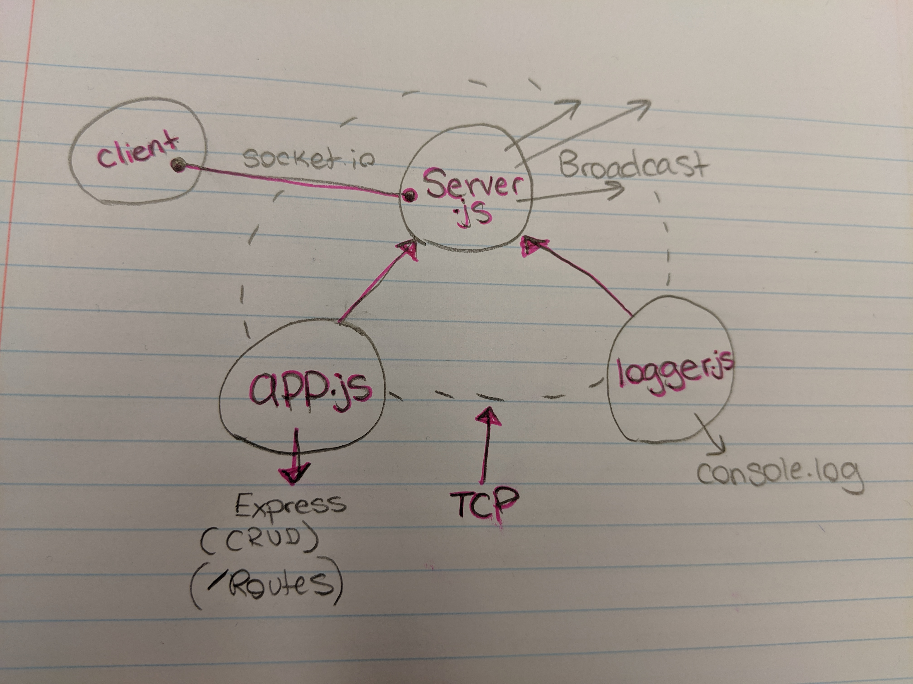

# LAB - 17

## TCP/Socket.io

### Author: Natalie Alway

### Links and Resources
* [submission PR]()
* [travis]()

#### Documentation
* [api docs]() (API servers)

### Setup
#### `.env` requirements (where applicable)
* `PORT` - Port Number
* `MONGODB_URI` - URL to the running mongo instance/db

#### How to initialize/run your server app (where applicable)
* `npm start`
* Endpoint: /docs
  * Returns JSdocs
  
#### Tests
* Unit Tests: `npm test`
* Lint Tests: `npm run lint`

#### UML

